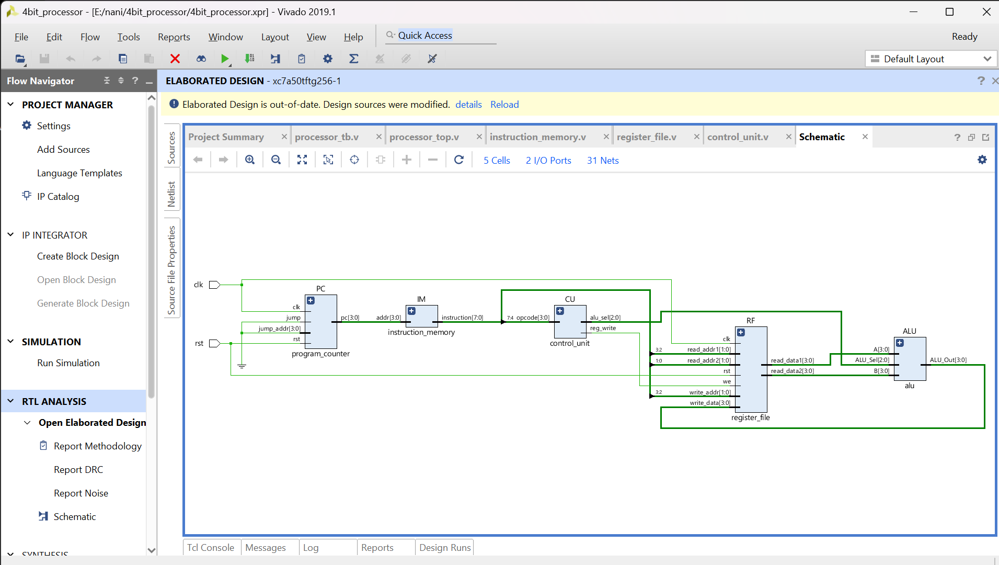
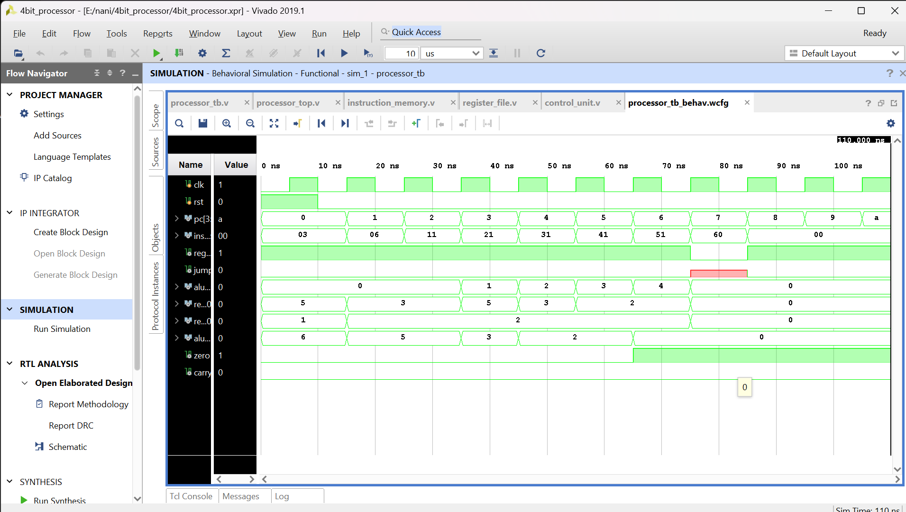

# 4-Bit Processor Design Using Verilog

## Overview

This project implements a custom 4-bit processor using Verilog HDL.

### Modules

- ALU
- Register File
- Program Counter
- Instruction Memory
- Control Unit

### Instructions

- MOVI
- ADD
- SUB
- AND
- OR
- XOR
- JMP

### Tools

- Verilog HDL
- Xilinx Vivado 2019.1

## Architecture

## RTL Design

## Waveform

## Results

Behavioral simulation verified instruction execution and ALU functionality.
